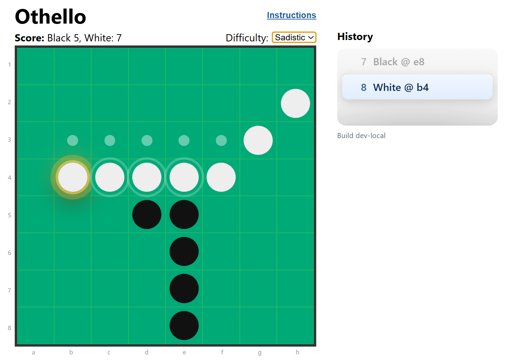

# Othello

A single-player browser implementation of Othello (Reversi) built with React, TypeScript, and Vite. Play online here: https://nickallan-kerv.github.io/othello/



## Features

- Full 8x8 Othello rules (legal-move detection, disc flipping, pass turns, game-over detection)
- Play as Black against AI-controlled White
- Three AI levels:
  - `Easy`: random legal move
  - `Medium`: greedy move (maximize immediate flips)
  - `Hard`: minimax with alpha-beta pruning and positional evaluation
- Move hints for legal player moves
- Hover preview for pending flips before placing a disc
- Move history with preview-on-hover and jump-back by double-clicking earlier checkpoints
- Undo/redo controls and full reset
- Animated flip effects and highlighted last move

## Gameplay Notes

- You play as Black and move first.
- If a side has no legal moves, that side automatically passes.
- The game ends when neither side has a legal move.
- Final score is total black discs vs white discs.

## Monty Python-Style Taunting

- The game includes a floating taunt system with absurd, theatrical, Monty Python-inspired insults and banter.
- Taunts are selected based on score difference:
	- Player far ahead: AI reacts with exaggerated outrage.
	- Close game: playful neutral commentary.
	- AI ahead: smug, overconfident taunts.
- New taunt bubbles are triggered after AI turns and at game-end moments.
- Repetition is reduced by tracking previously used lines and rotating through the pool.
- Taunt bubbles drift and fade across the board area for a lightweight comic effect.

## Quickstart

### Windows (fastest)

1. Double-click `start.bat` from File Explorer, or run:

	```powershell
	.\start.bat
	```

2. The script installs dependencies, starts Vite, and opens `http://127.0.0.1:5173/`.
3. To stop, close the terminal window opened by the script.

### Standard dev flow

1. Install dependencies:

	```bash
	npm install
	```

2. Start the dev server:

	```bash
	npm run dev
	```

3. Open `http://localhost:5173`.

## Scripts

- `npm run dev` - Start local dev server
- `npm run build` - Build production assets
- `npm run preview` - Preview production build locally
- `npm run test` - Run tests once with Vitest
- `npm run test:watch` - Run tests in watch mode

## Test Suite

Install dependencies (if not already installed):

```bash
npm install
```

Run unit tests:

```bash
npm run test
```

Optional coverage run:

```bash
npx vitest run --coverage
```

Current tests cover core game logic and UI components under `src/game` and `src/components`.
